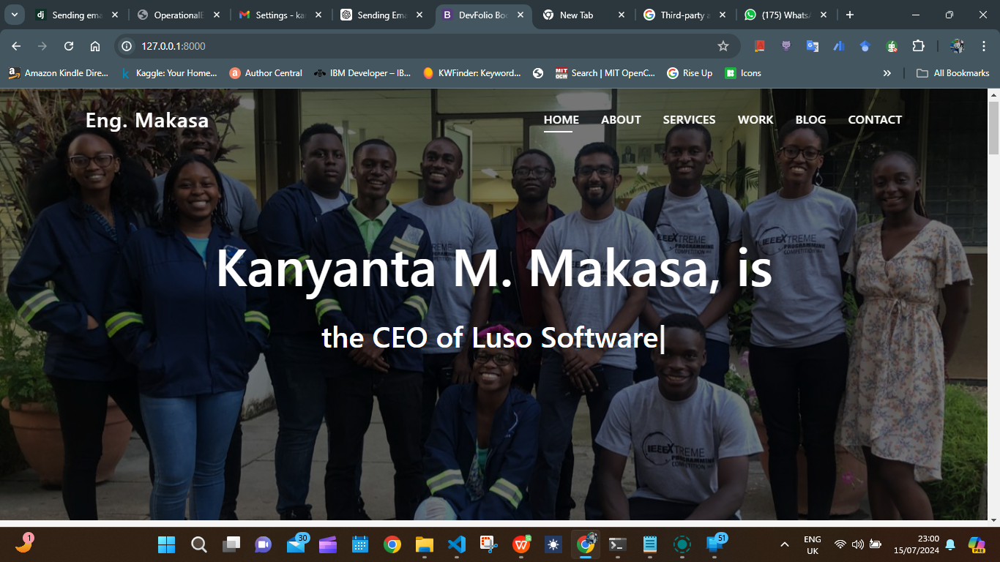
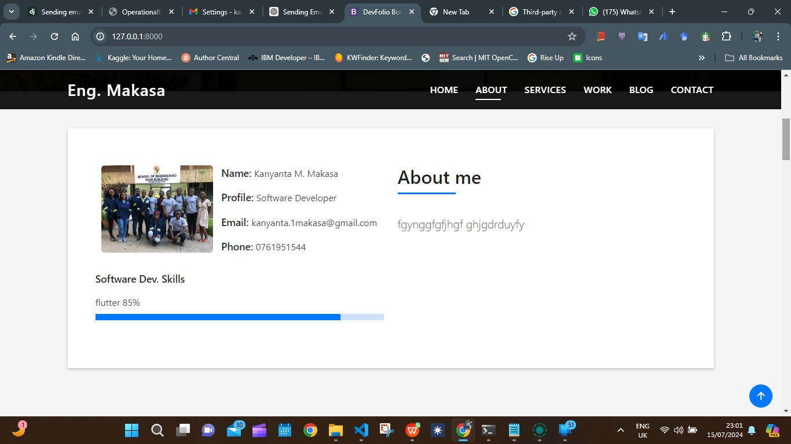
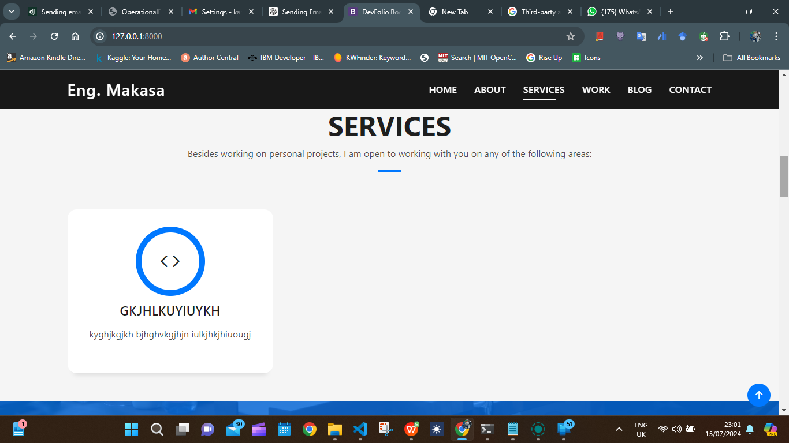
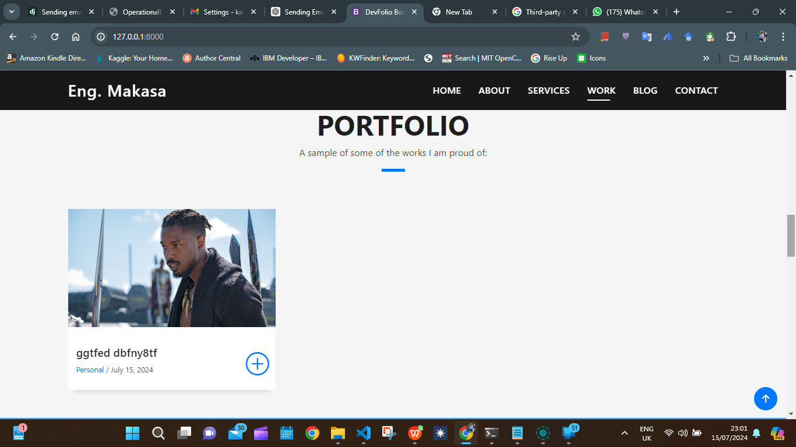

# Django Portfolio Website

This project is a personal portfolio website built using Django. The UI design is sourced from [BootstrapMade.com](https://bootstrapmade.com/), while the backend and dynamic functionality are fully implemented by me. The admin panel allows for easy customization of the website.

## Features

- **Dynamic Content Management:** The site has been transformed from static to dynamic using Django.
- **Admin Panel:** Customize the content of the website easily through the Django admin panel.
- **Responsive Design:** The UI is designed using Bootstrap, making it responsive and mobile-friendly.

## Screenshots

### Home Page


### About Me Page


### Services Page


### Portfolio Page


## Getting Started

### Prerequisites

- Python 3.x
- Django
- Bootstrap (included in the project)
- Any other dependencies listed in `requirements.txt`

### Installation

1. Clone the repository:

```bash
git clone https://github.com/yourusername/django-portfolio-website.git
cd django-portfolio-website
```
2. Create and activate a virtual environment:

```bash
python -m venv venv
source venv/bin/activate  # On Windows use `venv\Scripts\activate`
```

3. Install the dependencies:

```bash
pip install -r requirements.txt
```

4. Apply migrations:

```bash
python manage.py migrate
```

5. Create a superuser to access the admin panel:
   
```bash
python manage.py createsuperuser
```
6. Run the development server:
```bash
python manage.py runserver
```
7. Open your browser and go to http://127.0.0.1:8000 to see the website. Access the admin panel at `http://127.0.0.1:8000/admin` to customize the website.

### Customization
To customize the content of your website, log in to the Django admin panel with your superuser account. You can add, edit, or delete content such as your profile information, services, portfolio items, and more.

### Contributing
If you would like to contribute to this project, please follow these steps:

### Fork the repository.

1. Create a new branch:

```bash
git checkout -b feature/your-feature-name
```
2. Make your changes and commit them:
```bash
git commit -m "Add some feature"
```
3. Push to the branch:
```bash
git push origin feature/your-feature-name
```
4. Open a pull request.


## License
This project is open-source and available under the MIT License.

## Contact

For any inquiries or feedback, you can reach me at:

- **Email:** [kanyanta.1makasa@gmail.com](mailto:kanyanta.1makasa@gmail.com)
- **Phone:** [0761951544](tel:+260761951544)
- **Twitter:** [@Its_Kanyanta](https://twitter.com/Its_Kanyanta)
- **LinkedIn:** [Kanyanta M. Makasa](https://www.linkedin.com/in/kanyanta-makasa)

## Acknowledgements

- UI design by [BootstrapMade](https://bootstrapmade.com/)

